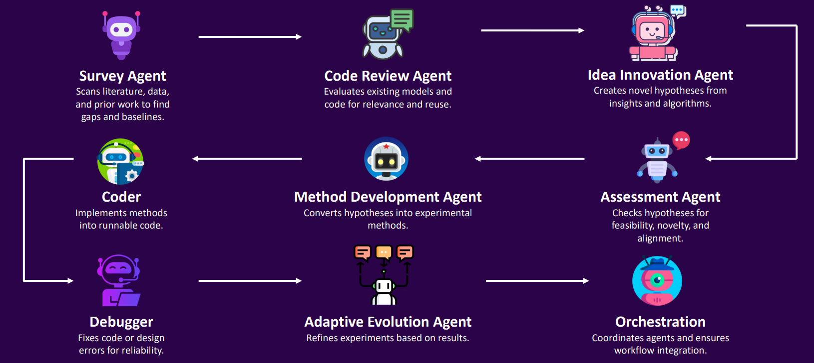
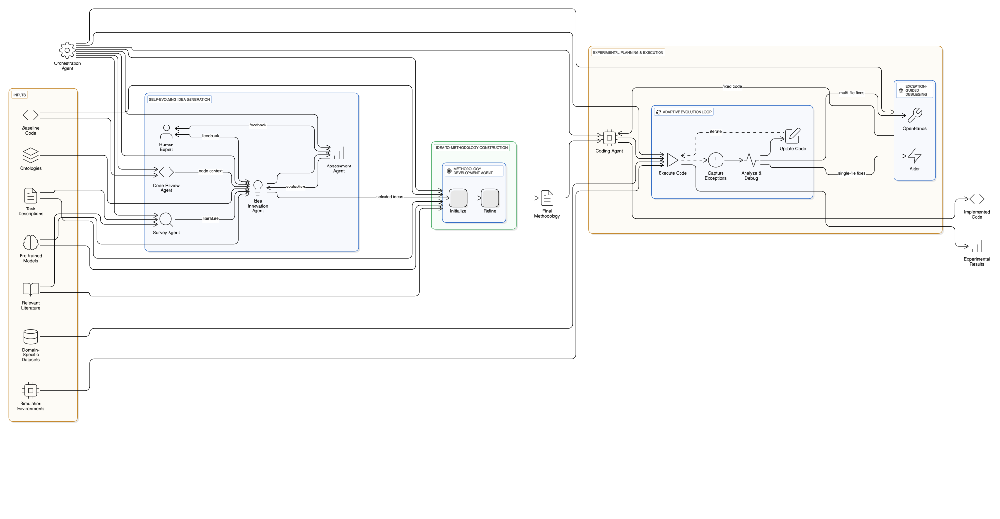
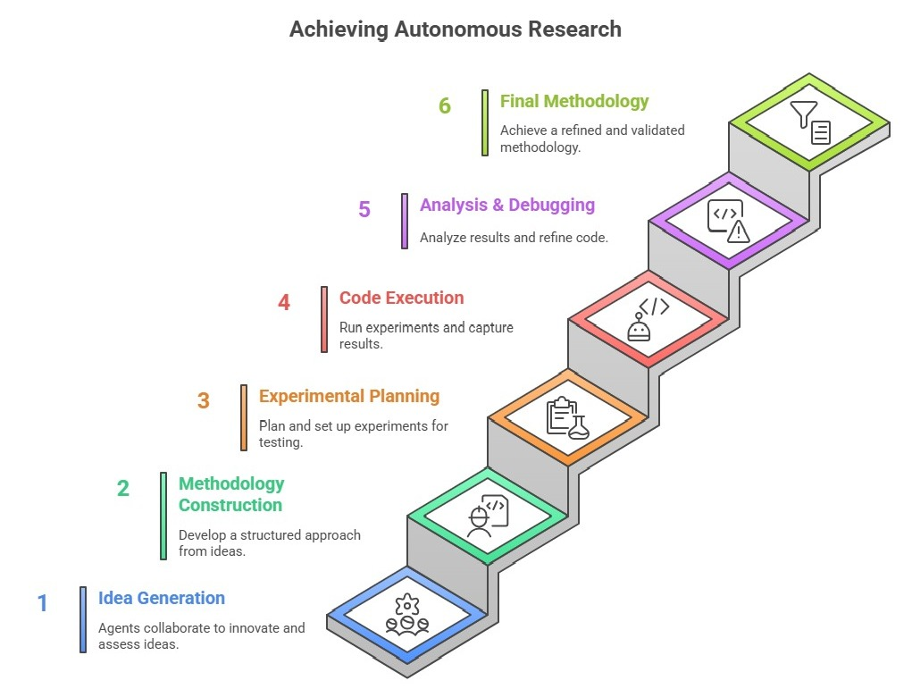

# 🧪 SciFusion – Autonomous AI for Scientific Research

## 🔍 Project Overview

**SciFusion** is an AI-powered research assistant designed to revolutionize scientific discovery through intelligent, autonomous workflows. By leveraging the **NovelSeek multi-agent framework**, it automates the **entire scientific process**—from generating hypotheses to designing and executing experiments, and refining outcomes with expert feedback in a closed-loop system.

> 🚀 **Goal:** Reduce manual workload, time, and cost in traditional research, enabling scientists to focus on deeper thinking and innovative discoveries.

---

## 👨‍🔬 Intended Users

SciFusion is designed for a wide range of users in the scientific and technological domains:

- 🧑‍🔬 Scientists in Labs or R&D Teams
- 🤖 AI/ML Researchers
- 📊 Data Scientists
- 🎓 Students working on Research Projects
- 🧬 Healthcare & Bioinformatics Professionals
- 🚀 Startup Founders and Entrepreneurs
- ✍️ Content Writers and Analysts
- 🌱 Environmental Analysts

---

## 💡 Key Features

- ✅ Autonomous **hypothesis generation** and refinement
- ✅ Intelligent **experiment design and execution**
- ✅ Seamless **integration of human expert feedback**
- ✅ End-to-end **automation of the scientific research pipeline**

---

## ⚙️ Why Agentic Workflows?

SciFusion embraces the **agentic paradigm** to replicate the structure of collaborative research teams. Each AI agent is a domain-specialized entity responsible for a focused task within the research lifecycle.

### 🧠 Benefits

- 🎯 **Task Specialization** – Clear role separation (e.g., idea generation, coding, debugging)
- 🔁 **Feedback Loop** – Real-time integration of human expert feedback
- 📈 **Scalability** – Adaptable across scientific domains and use cases
- ⚡ **Efficiency** – Parallel agent operations to speed up workflows

---

## 🧩 Agent Roles

| 🧠 Agent Name             | 💼 Responsibility |
|---------------------------|-------------------|
| **Survey Agent**          | Collects domain-specific knowledge to assist with idea and methodology generation |
| **Idea Innovation Agent** | Uses LLMs to propose novel hypotheses and research ideas |
| **Methodology Agent**     | Transforms selected ideas into detailed, executable research plans |
| **Coding Agent**          | Performs iterative code generation, evaluation, and refinement |
| **Aider (Debugger)**      | Debugs exceptions in single files and applies quick fixes |
| **Code Review Agent**     | Analyzes code for bugs, reusable logic, and performance issues |
| **Assessment Agent**      | Automatically evaluates results and incorporates expert feedback |
| **Orchestration Agent**   | Manages task coordination, memory, and human-in-the-loop systems |

 

---

## 🛠️ Tech Stack

  <!-- Icons Row -->
  
  
  
  
  
  
  
  

### 🔍 Stack Description

* ⚛️ **React.js** – Frontend library to build dynamic, responsive user interfaces.
* 🌐 **Node.js** – Backend runtime environment for executing JavaScript server-side.
* ⚙️ **Express.js** – Lightweight backend framework for handling routes and APIs.
* 🍃 **MongoDB** – NoSQL database used for storing research content and metadata.
* ⚡ **FastAPI** – High-performance Python framework to serve AI agent APIs.
* 🐍 **Python** – Core language for LLM orchestration, agents, and scientific logic.
* 🐳 **Docker** – Containerizes the entire system to ensure consistent deployments.
* 🛠️ **GitHub** – Source code management, version control, and collaboration.

---

## 🏗️ System Architecture

 

---
## 🔄 Workflow Overview

 

---
## 👥 Contributors

| 👤 Name              | 🌐 GitHub Profile                                    | Milestone 1                                                                                                                                                                                                                                                                                                                                                                                                                                                                | Milestone 2                                                                                                                                                                                                                                                                                                                                                                                                                                                            |
| -------------------- | ---------------------------------------------------- |----------------------------------------------------------------------------------------------------------------------------------------------------------------------------------------------------------------------------------------------------------------------------------------------------------------------------------------------------------------------------------------------------------------------------------------------------------------------------|------------------------------------------------------------------------------------------------------------------------------------------------------------------------------------------------------------------------------------------------------------------------------------------------------------------------------------------------------------------------------------------------------------------------------------------------------------------------|
| Gadarla Ritesh Reddy | [@RiteshGadarla](https://github.com/RiteshGadarla)   | [PPT](https://drive.google.com/file/d/1P8RrqLYocWytXG33tSXZbv4Rx2MkaDU6/view) - [Video](https://www.youtube.com/watch?v=MaGSMHQxBxw)  | [PPT](https://drive.google.com/file/d/1T5474Q_G947a2Tnf0qLLASYhp7-FALyj/view) - [Video](https://www.youtube.com/watch?v=mpKb6BQeiuQ) |
| Ellendula Sahasrika  | [@Sahasrika15](https://github.com/Sahasrika15)       | [PPT](https://docs.google.com/presentation/d/1YKt1dM-Tn8Oz6iXDiTjeo5yUj3hkBCwk/edit?usp=sharing&ouid=103201219500725630211&rtpof=true&sd=true) - [Video](https://www.youtube.com/watch?v=X4wf_BUpZSQ)                                                                                                                                                                                                                                                                                                                                                                                                                                                | [PPT](https://drive.google.com/file/d/1KN3-i8JzSd7ONgemrK652lDZYq9sjtDV/view?usp=sharing) - [Video](https://youtu.be/sDFqBNvgLeQ)                                                                                                                                                                                                                                                                                                                                                                                                                                            |
| Gajvelli Rohan Rao   | [@rohan6891](https://github.com/rohan6891)           | [PPT](https://docs.google.com/presentation/d/1Of12A6tVmKCH0v5SErQTTZdVe-o7JigsMtROaacgeJ8/edit?usp=sharing) - [Video](https://www.youtube.com/watch?v=q32oeX7X40A)                                                                                                                                                                                                                                                                                                                                                                                                                                                | [PPT](https://docs.google.com/presentation/d/1_I_bgMYTGafawkUGmzh1dDOCoJKmMqcbv_H_baTtQps/edit?usp=sharing) - [Video](https://youtu.be/TfSPvXUp2oc)                                                                                                                                                                                                                                                                                                                    |
| Kaspa Karthikeya     | [@Karthikeya0201](https://github.com/Karthikeya0201) | [PPT](https://drive.google.com/file/d/1R4mw9lkdQ1EcEHNOVhWLg2i7dHRsr6q0/view?usp=drive_link) - [Video](https://www.youtube.com/watch?v=joLj0t1_XS8)                                                                                                                                                                                                                                                                                                                                                                                                                                                | [PPT](https://drive.google.com/file/d/1HmZmcVtguIK8gTv9RMX1kWfLUBBef6wK/view?usp=drive_link) - [Video](https://www.youtube.com/watch?v=m2DlAdB8ues)                                                                                                                                                                                                                                                                                                                                                                                                                                            |
| Katike Rohit Reddy   | [@K-Rohit-Reddy](https://github.com/K-Rohit-Reddy)   | [PPT](https://drive.google.com/file/d/1YUZP2DusvrxGNujxK3EnTq3Ihe_mM4sr/view?usp=sharing) - [Video](https://youtu.be/CQYLu87cNgc)                                                                                                                                                                                                                                                                                                                                                                                                                                                | [PPT](https://drive.google.com/file/d/1z5qICZZRYuM51JjkmCtp2FK6AjcEhA-f/view?usp=sharing) - [Video](https://youtu.be/qfLtdtnbIRA)                                                                                                                                                                                                                                                                                                                                                                                                                                            |

---