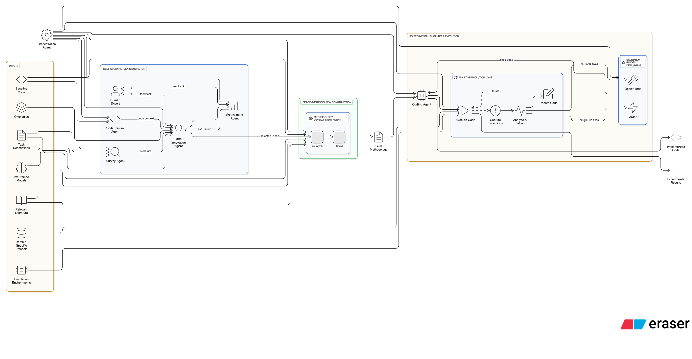

# 🧪 SciFusion – Autonomous AI for Scientific Research

## 🔍 Project Overview

**SciFusion** is an AI-powered research assistant designed to revolutionize scientific discovery through intelligent, autonomous workflows. By leveraging the **NovelSeek multi-agent framework**, it automates the **entire scientific process**—from generating hypotheses to designing and executing experiments, and refining outcomes with expert feedback in a closed-loop system.

> 🚀 **Goal:** Reduce manual workload, time, and cost in traditional research, enabling scientists to focus on deeper thinking and innovative discoveries.

---

## 👨‍🔬 Intended Users

SciFusion is designed for a wide range of users in the scientific and technological domains:

- 🧑‍🔬 Scientists in Labs or R&D Teams
- 🤖 AI/ML Researchers
- 📊 Data Scientists
- 🎓 Students working on Research Projects
- 🧬 Healthcare & Bioinformatics Professionals
- 🚀 Startup Founders and Entrepreneurs
- ✍️ Content Writers and Analysts
- 🌱 Environmental Analysts

---

## 💡 Key Features

- ✅ Autonomous **hypothesis generation** and refinement
- ✅ Intelligent **experiment design and execution**
- ✅ Seamless **integration of human expert feedback**
- ✅ End-to-end **automation of the scientific research pipeline**

---

## ⚙️ Why Agentic Workflows?

SciFusion embraces the **agentic paradigm** to replicate the structure of collaborative research teams. Each AI agent is a domain-specialized entity responsible for a focused task within the research lifecycle.

### 🧠 Benefits

- 🎯 **Task Specialization** – Clear role separation (e.g., idea generation, coding, debugging)
- 🔁 **Feedback Loop** – Real-time integration of human expert feedback
- 📈 **Scalability** – Adaptable across scientific domains and use cases
- ⚡ **Efficiency** – Parallel agent operations to speed up workflows

---

## 🧩 Agent Roles

| 🧠 Agent Name             | 💼 Responsibility |
|---------------------------|-------------------|
| **Survey Agent**          | Collects domain-specific knowledge to assist with idea and methodology generation |
| **Idea Innovation Agent** | Uses LLMs to propose novel hypotheses and research ideas |
| **Methodology Agent**     | Transforms selected ideas into detailed, executable research plans |
| **Coding Agent**          | Performs iterative code generation, evaluation, and refinement |
| **Aider (Debugger)**      | Debugs exceptions in single files and applies quick fixes |
| **OpenHands Debugger**    | Handles complex, multi-file codebase debugging |
| **Code Review Agent**     | Analyzes code for bugs, reusable logic, and performance issues |
| **Assessment Agent**      | Automatically evaluates results and incorporates expert feedback |
| **Orchestration Agent**   | Manages task coordination, memory, and human-in-the-loop systems |

---

## 🛠️ Tech Stack

  <!-- Icons Row -->
  
  
  
  
  
  
  
  

### 🔍 Stack Description

* ⚛️ **React.js** – Frontend library to build dynamic, responsive user interfaces.
* 🌐 **Node.js** – Backend runtime environment for executing JavaScript server-side.
* ⚙️ **Express.js** – Lightweight backend framework for handling routes and APIs.
* 🍃 **MongoDB** – NoSQL database used for storing research content and metadata.
* ⚡ **FastAPI** – High-performance Python framework to serve AI agent APIs.
* 🐍 **Python** – Core language for LLM orchestration, agents, and scientific logic.
* 🐳 **Docker** – Containerizes the entire system to ensure consistent deployments.
* 🛠️ **GitHub** – Source code management, version control, and collaboration.

---

## 🏗️ System Architecture

 

---
## 🔄 Workflow Overview

 

---
## 👥 Contributors

| 👤 Name                  | 🌐 GitHub Profile                                              |
|--------------------------|---------------------------------------------------------------|
| Gadarla Ritesh Reddy     | [@Ritesh2006M](https://github.com/Ritesh2006M)               |
| Ellendula Sahasrika      | [@Sahasrika15](https://github.com/Sahasrika15)               |
| Gajvelli Rohan Rao       | [@rohan6891](https://github.com/rohan6891)                   |
| Kaspa Karthikeya         | [@Karthikeya0201](https://github.com/Karthikeya0201)         |
| Katike Rohit Reddy       | [@K-Rohit-Reddy](https://github.com/K-Rohit-Reddy)           |

---